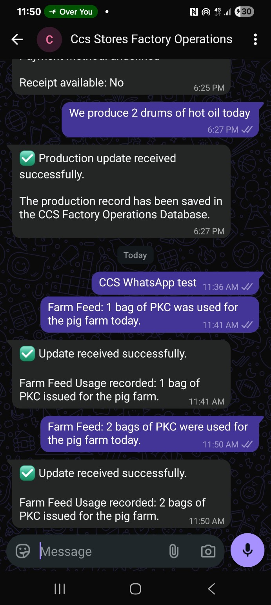
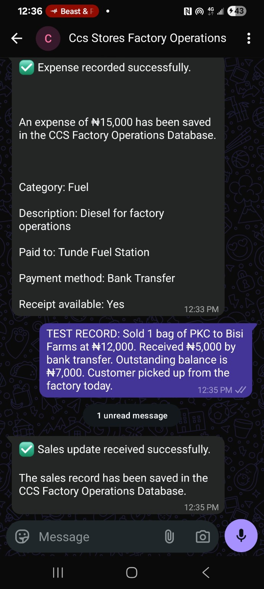
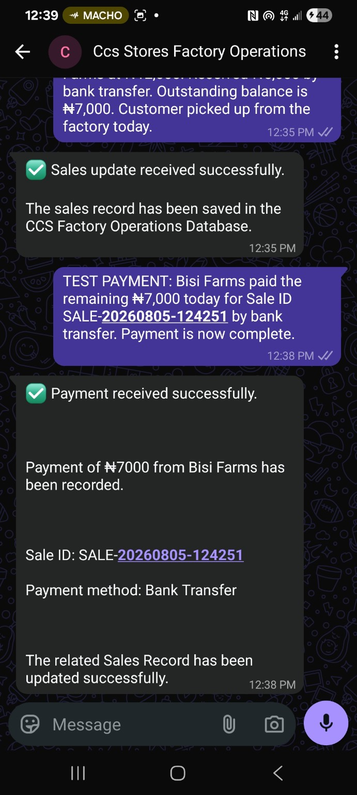
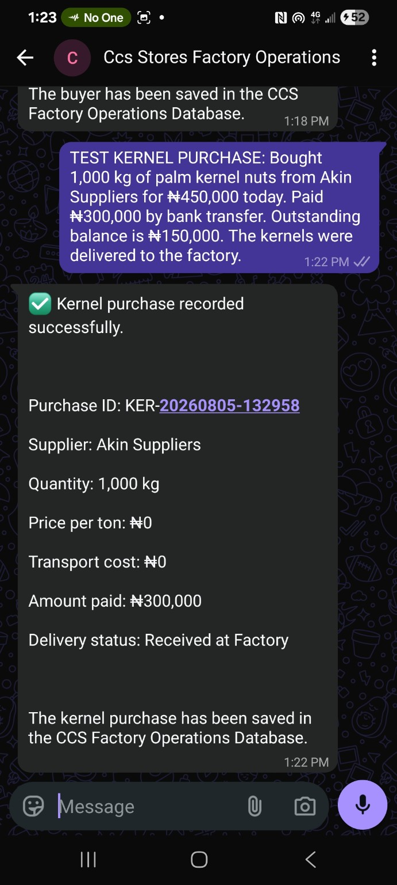

# CCS Stores AI Factory Operations Assistant

A WhatsApp-first **AI operations automation system** designed by **Aureon AI** for CCS Stores, a palm-kernel processing business in Ilesha, Osun State, Nigeria.

The project converts informal factory updates into structured operational records so management can monitor **raw materials, production, inventory, sales, expenses, payments, deliveries, buyers, farm-feed usage, and livestock activity** without manually rebuilding reports from chat messages.

> **Project status:** Working prototype / in development. Core record-routing flows have been tested. The live WhatsApp production connection and full scheduled management-report deployment remain ongoing work.

## Business problem

Factory updates are naturally sent through WhatsApp. When those updates stay only in chat, management has to manually interpret messages, reconcile stock, track payments, and rebuild reports. That creates avoidable delays and increases the chance of missing or inconsistent records.

This system is designed to turn those messages into structured data automatically while keeping WhatsApp as the familiar interface for factory staff.

## What the system does

- Receives structured factory updates through WhatsApp-style messages.
- Classifies each update into the correct operational route.
- Sends the data through n8n for processing and validation.
- Records the result in a structured Google Sheets operations database.
- Sends an acknowledgement after a record is saved.
- Supports management reporting for morning/evening operational summaries.
- Tracks product-specific rules for PKO and PKC.

## Architecture

```text
Factory Manager / Staff
        |
        v
     WhatsApp
        |
        v
       n8n
        |
        +--> Classify update type
        |       |- Production
        |       |- Sales
        |       |- Expenses
        |       |- Payments
        |       |- Deliveries
        |       |- Buyers
        |       |- Raw materials
        |       |- Farm feed
        |       `- Pig farm activity
        |
        v
 Google Sheets Operations Database
        |
        +--> Inventory calculations
        +--> Payment / balance tracking
        +--> Production records
        `--> Management summaries
        |
        v
 WhatsApp acknowledgement / report
```

A Mermaid version is available in [`docs/architecture.md`](docs/architecture.md).

## Live System Evidence

### n8n Factory Operations Workflow


The n8n canvas shows the automation layer that receives, classifies, routes, and processes factory operational updates before writing them to the correct records.

### Google Sheets Operations Database


The Google Sheets database provides the structured operational record layer used for inventory, production, sales, expenses, payments, deliveries, buyers, raw materials, farm-feed usage, and related factory activity.

## Operational database

The system is designed around these records:

| Area | Purpose |
|---|---|
| Product & Inventory | Current PKO / PKC stock position |
| Production Records | Daily production updates |
| Sales Records | Buyer, product, quantity, amount and balance |
| Expenses Records | Factory operating expenses |
| Payment Records | Payments tied back to sales |
| Delivery Records | Dispatch and delivery status |
| Buyers Records | Buyer information and history |
| Raw Materials Inventory | Palm-kernel purchases and stock |
| Farm Feed Usage | PKC issued to the pig farm |
| Pig Farm Records | Birth, death and purchase activity |

See [`docs/data-model.md`](docs/data-model.md) for the portfolio-level schema.

## Factory-specific rules implemented in the design

- **PKO production:** approximately 6 settled 200-litre drums are treated as 1 ton for operational estimation.
- **PKC:** 50 kg per bag; 20 bags make 1 ton.
- **Farm feed:** PKC issued to the pig farm reduces PKC inventory and is logged separately.
- **Payments:** part-payments can be recorded and outstanding balances tracked against the original sale.
- **Raw materials:** kernel purchases capture supplier, quantity, amount paid and delivery status.

## Test evidence

The repository includes screenshots from working test flows.

### Production + farm feed



Example test messages include production of **2 drums of hot oil** and **1 bag of PKC used for the pig farm**, followed by successful database acknowledgements.

### Expense + sale



Example tests include a **₦15,000 fuel/diesel expense** and a **1-bag PKC sale to Bisi Farms for ₦12,000**, with part-payment and balance tracking.

### Payment update



A later payment test records the remaining **₦7,000** against sale `SALE-20260805-124251` and confirms the related sales record was updated.

### Raw-material purchase



A kernel-purchase test records **1,000 kg of palm kernel nuts**, payment information and delivery status, generating purchase ID `KER-20260805-132958`.

## WhatsApp Factory Demo Video

[Watch the CCS Stores AI Factory Operations Assistant WhatsApp demo](https://youtu.be/U10FNiXdQ0s)

This demo shows the WhatsApp-first factory workflow in action, including how operational updates are captured and routed into the factory operations system.

## Tech stack

- **n8n** — workflow orchestration
- **WhatsApp** — staff-facing operations channel
- **Google Sheets** — structured operations database
- **Google Gemini / AI extraction** — structured interpretation where required
- **JavaScript / expressions / JSON** — routing and data transformation
- **Webhooks / APIs** — integration layer

## Why this project matters

This is not a generic chatbot demo. It is an operational automation project based on a real palm-kernel factory workflow and real management requirements.

The goal is to reduce manual reporting, improve inventory visibility, keep payment and production records consistent, and let management monitor factory activity remotely.

## Current implementation status

**Working / tested:**

- Production record flow
- Sales record flow
- Expense record flow
- Payment flow
- Raw-material purchase flow
- Farm-feed usage flow
- Pig-farm birth/death/purchase routing tests
- Google Sheets database structure and validation rules
- WhatsApp acknowledgement patterns

**Still being completed:**

- Final live WhatsApp production connection
- Full end-to-end reliability testing on the live channel
- Morning/evening scheduled management reports
- 24/7 hosting / production deployment

## Workflow export

The sanitized public n8n export is **not included yet** because the current saved project archive does not contain the latest Factory Operations workflow JSON. The real workflow should be exported from n8n, sanitized for credentials, webhook IDs, spreadsheet IDs and other private values, and then placed in [`workflows/`](workflows/).

See [`workflows/README.md`](workflows/README.md) before publishing an export.

## Security and privacy

Do not commit:

- API keys or OAuth credentials
- WhatsApp access tokens
- private webhook URLs
- Google Sheet IDs tied to production data
- customer personal information
- internal credential IDs from n8n exports

Public workflow exports should use placeholders for environment-specific values.

## Built by

**Aureon AI**  
*Building Intelligent Business Systems*  
*We Build AI Employees for Businesses.*

Website: https://aureonai.framer.ai  
Email: hello.aureonai@gmail.com
