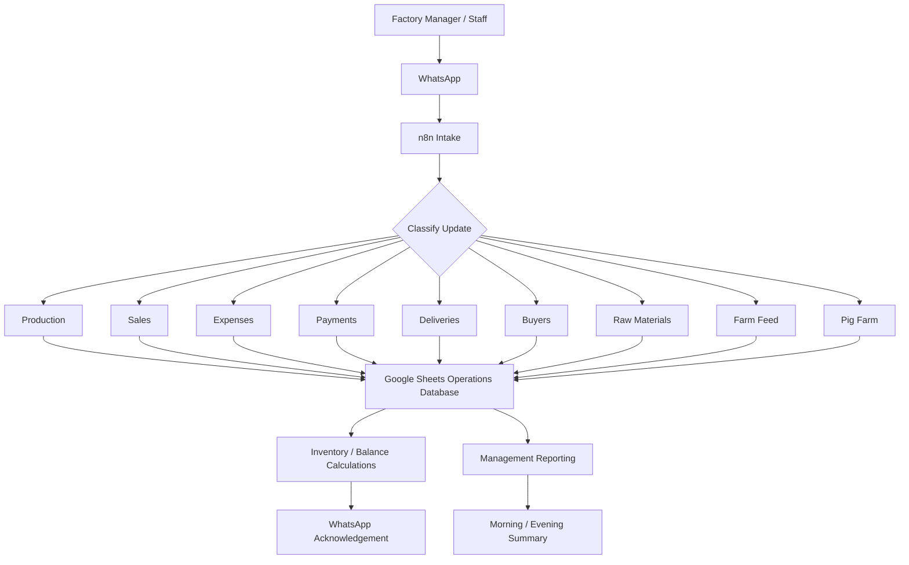

# System Architecture

## Design principle

The automation keeps the staff interface simple: factory staff send operational information through a channel they already use, while the system performs classification, structured storage and calculation behind the scenes.
